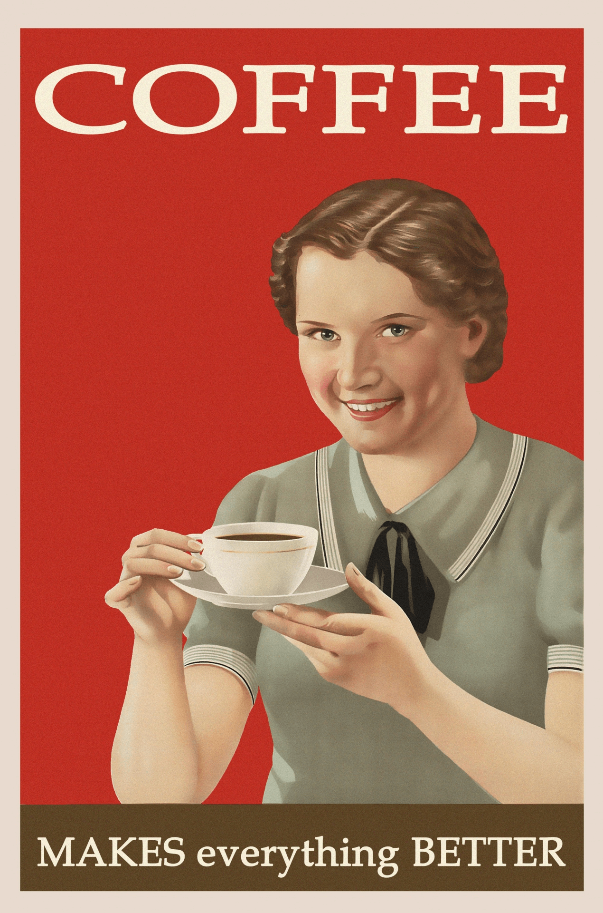
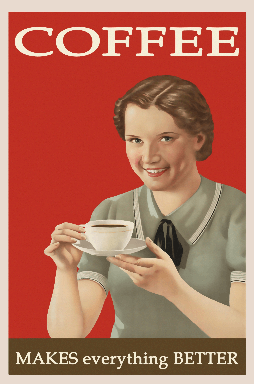

# img_to_pixel_art

## Introduction
This project contains a Python script that transforms any image into pixel art. The script analyzes the image and determines the best block size for the pixel art based on color homogeneity. It also allows specifying a block size manually. The resulting pixel art image maintains the essential features and colors of the original image, but with a unique pixelated aesthetic.

## Installation
To run this script, you need Python installed on your machine. Clone this repository and navigate into the project directory. Then, install the required dependencies:

```bash
pip install -r requirements.txt
```

## Usage
Run the script with the following command:

```bash
python img_to_pixel_art.py <path_to_image>
```

To specify a block size and the number of colors, use:

```bash
python img_to_pixel_art.py <path_to_image --block_size <block_size> --n_colors <n_colors>

```

Replace <path_to_image> with the path to your image file and <block_size> with the desired size of each pixel block (optional).

## Learning Purpose

This project is intended for educational purposes. It provides a practical example of image processing using Python, demonstrating techniques such as color analysis, multiprocessing, and image manipulation with libraries like NumPy and PIL.


## Comparing Results
To see the difference between pixel art transformation and conventional resizing methods, compare the three images. The pixel art image will have a distinct, stylized appearance that differs significantly from the smoothly resized image.

### Original


### Pixeled


### Resized


