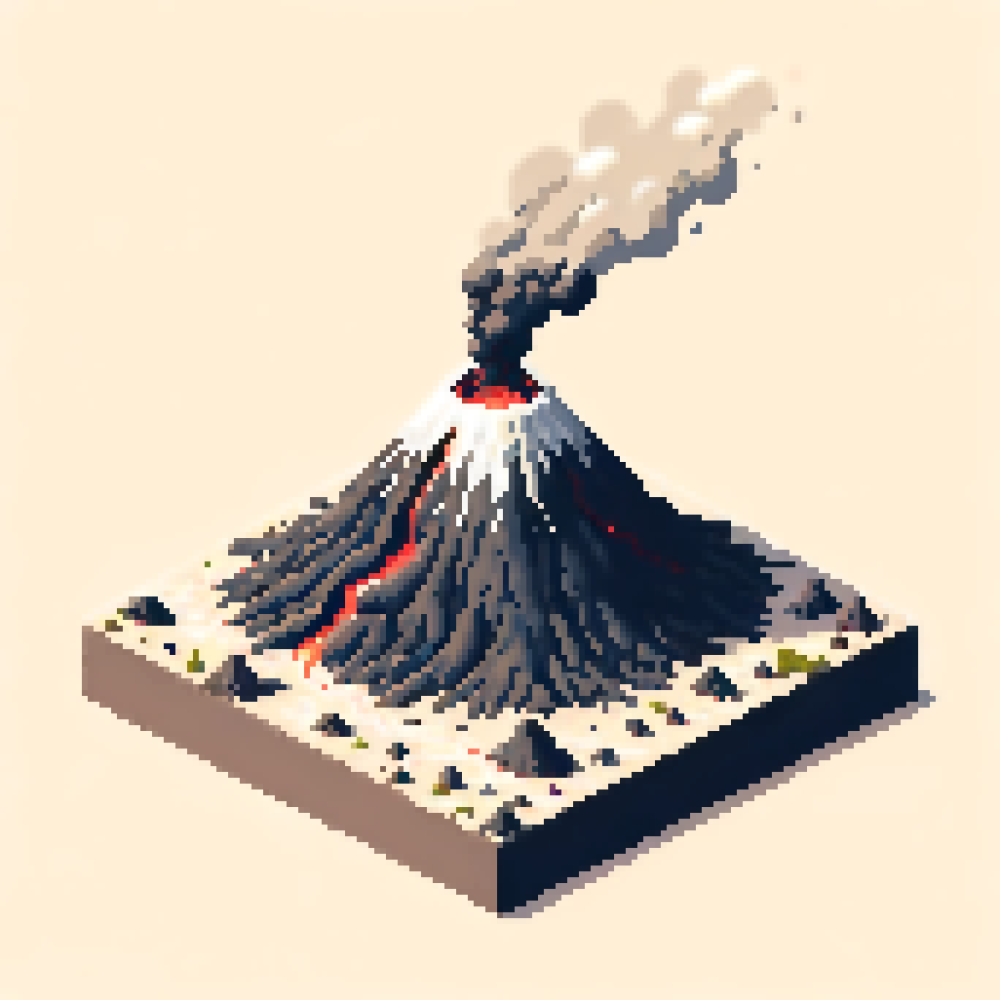
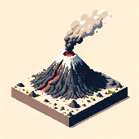
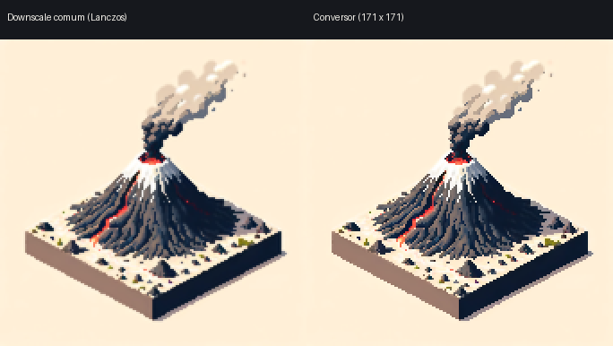

# img_to_pixel_art

Converts one raster image per execution into a compact PNG with one colour per
detected cell. The input is loaded as RGB/RGBA, the grid is detected (or set
with `--block_size`), and `two_stage_pack` reconstructs the result.

## Installation

```bash
pip install -r requirements.txt
```

## CLI

```bash
python img_to_pixel_art.py INPUT [--block_size FLOAT] [--n_colors INT]
                                [--palette HEX,...] [--mode full|fast]
                                [--dither none|ordered|floyd]
                                [--keep-alpha] [--output PATH]
```

Without `--block_size`, detection runs independently on both axes. With a
manual block size `B`, the output grid is `round(W/B) x round(H/B)`.
`--n_colors` limits RGB colours to 1–256: it both seeds the reconstruction
k-means and hard-caps the final image with a second RGB k-means pass; alpha
remains a separate binary channel. `--palette` maps RGB values to an explicit
palette. It accepts comma-separated `RRGGBB`/`#RRGGBB` colours or an image path;
a palette image with more than 256 unique colours is reduced to 256 with
k-means. `--dither` (`ordered` Bayer 4x4, or `floyd` error diffusion) applies
when snapping to `--n_colors` or `--palette`. `--keep-alpha` writes a
tent-weighted continuous alpha instead of a 0/255 per-cell vote. `--output`
overrides the destination path. `--mode fast` selects the low-latency
detection path.

The output is saved beside the input as `STEM_COLSxROWS_pixeled.png` unless
`--output` is given.

```bash
python img_to_pixel_art.py vulcao.png
python img_to_pixel_art.py sprite.png --block_size 8 --n_colors 16
python img_to_pixel_art.py sprite.png --block_size 8 --n_colors 16 --dither floyd
python img_to_pixel_art.py sprite.png --block_size 8 \
  --palette "#0b132b,#3a506b,#5bc0be,#f0f3bd" --dither ordered
python img_to_pixel_art.py sprite.png --block_size 8 --palette palette.png
```

## Example

Input image:



Pixel-art result (`171 x 171`, detected from 6-pixel cells):



Comparison with a normal Lanczos downscale. The converter keeps one
representative colour per detected cell, producing the block structure and
sharper pixel boundaries shown on the right:



The example images can be regenerated with:

```bash
PYTHONPATH=. ./.venv/bin/python examples/generate_readme_examples.py
```

## Python API

```python
from pixel_art_converter import detect, two_stage_pack, map_to_palette

det = detect(rgba, mode="full")            # det.step_x/step_y are in source pixels
small = two_stage_pack(rgba, det.cols, det.rows, k_colors=16, binary_alpha=False)
small = map_to_palette(small[..., :3], palette, method="floyd")
```

The package contains the active detection estimators (`autocorr`, `boundary`,
`selfsim` plus the heavy arbiter), quantization helpers, the dithering module,
image utilities, and the canonical reconstruction path. The top-level script
is the only user-facing CLI.

## Tests

```bash
python -m pytest
```

The test suite covers RGB/RGBA input, transparency, automatic and manual grid
detection, fast mode, palette limits, invalid arguments, and PNG output, plus a
synthetic-grid detection sweep, source-unit step reporting under subsampling,
the k-means palette cap, dithering, and continuous-alpha output.
